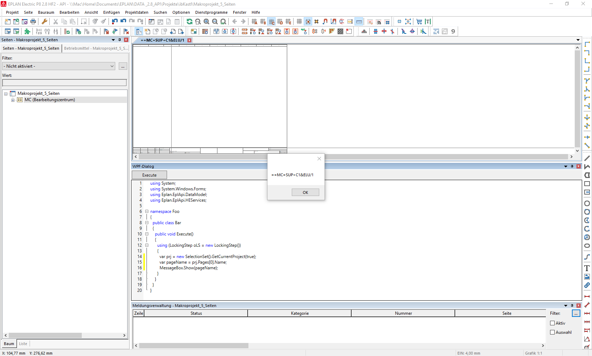

# EPLAN CodeEditor

Here's a simple code editor wich allows to write and execute code in EPLAN Electric P8. The editor is build in a dockable [DialogBarFactory](https://suplanus.de/navigator-in-api/) 👈🦄. 
After loading the AddIn, the dialog can be opened by executing `CodeEditor` for example via a toolbar button.

My target was to save time if some quick (and dirty) programatical solution is needed in EPLAN. 
My hope was to save even more time if I could sign the AddIn and use it with a EPLAN-Runtime license without the need of switching to a developer license with the API-Extension.
But for some reason the invoked method wont execute. 😢

However, even with the developer licence not everything what works with a common API AddIn worked for me through this editor. Most struggle I had with locking. A LockingStep worked best for me.



## Building the assembly
There a lot of ways described on the web, how to execute C# code on runtime. The way I figured out for me is to use CSharpCodeProvider wich is derived from CodeDomProvider to get the assembly.
```csharp
CSharpCodeProvider codeProvider = new CSharpCodeProvider();
CompilerParameters parameters = new CompilerParameters();
parameters.GenerateExecutable = false;
parameters.ReferencedAssemblies.Add("System.dll");
parameters.ReferencedAssemblies.Add("All EPLAN assemblies");
...
CompilerResults compilerResults = codeProvider.CompileAssemblyFromSource(parameters, source);
```
The `CompilerResults` object carries all the further needed stuff like the assebly or if the compiling went wrong it contains a list of errors.

## Executing the code
In this example there has to be a class named `Bar` from the namespace `Foo` and a method called `Execute`. The method will be invoked via reflection
```csharp
Object obj = assembly.CreateInstance("Foo.Bar");
MethodInfo execute = assembly.GetType("Foo.Bar").GetMethod("Execute");
execute.Invoke(obj, null);
```
## The editor

There are two most mentioned wpf controls on stackoverflow wich comes syntax highlighting and code completion. 
- [AvalonEdit](http://avalonedit.net)
- [and the one from Syncfusion](https://www.syncfusion.com/wpf-ui-controls/syntax-editor)
I decided to use the second one because the usage for C# is pretty easy. 
```xml
<syncfusion:EditControl
                x:Name="editControl1"
                DocumentLanguage="CSharp"
                IntellisenseMode="Auto" />
```
and create a  `List<Uri>` with the EPLAN API binaries and others you like to use.
```csharp
List<Uri> references = new List<Uri>();
      string binPath = PathMap.SubstitutePath("$(BIN)");
      references.Add(new Uri($@"{binPath}\Eplan.EplApi.AFu.dll", UriKind.Absolute));
      references.Add(new Uri($@"{binPath}\Eplan.EplApi.Baseu.dll", UriKind.Absolute));
      references.Add(new Uri($@"{binPath}\Eplan.EplApi.DataModelu.dll", UriKind.Absolute));
      references.Add(new Uri($@"{binPath}\Eplan.EplApi.EServicesu.dll", UriKind.Absolute));
      references.Add(new Uri($@"{binPath}\Eplan.EplApi.Guiu.dll", UriKind.Absolute));
      references.Add(new Uri($@"{binPath}\Eplan.EplApi.HEServicesu.dll", UriKind.Absolute));
      references.Add(new Uri($@"{binPath}\Eplan.EplApi.MasterDatau.dll", UriKind.Absolute));
      references.Add(new Uri($@"{binPath}\Eplan.EplApi.Starteru.dll", UriKind.Absolute));

      editControl1.AssemblyReferences = references;
```